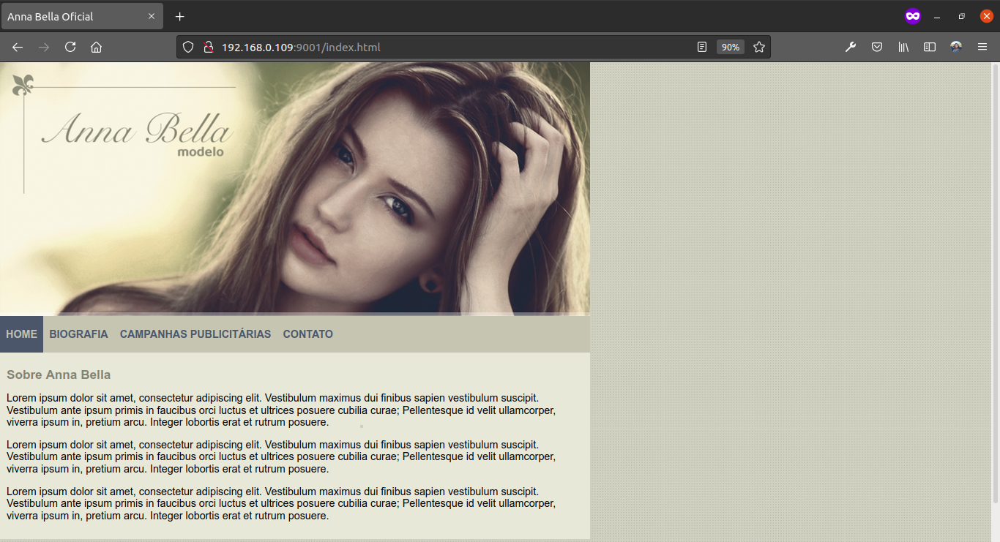

# Anna Bella Modelo

## Table of contents

- [Introduction](#introduction)
- [Description](#description)
- [Demo](#demo)
- [Setup](#setup)
- [Usage](#usage)
- [Technical info](#technical-info)

  [Languages](#languages)

  [Dependencies](#dependencies)

  [DevDependencies](#devdependencies)

- [Credits](#credits)
- [Lincense](#license)

## Introduction

This is the website of the fictitious model Anna Bella.

     

## Description

This project was developed with the intent to promote the practice of the knowledge acquired during the first part of the CSS3 lessons section of the online course
[Desenvolvimento Web Completo 2021 - 20 cursos + 20 projetos](https://www.udemy.com/course/web-completo/).

[//]: # "this is a workaround to make a comments"
[//]: # "## Features"
[//]: # "## Demo"

## Demo

[Modelo Anna Bella](https://kind-khorana-36270a.netlify.app/)

## Technical info

### Languages

 

### Dependencies

### DevDependencies

                     

## Setup

Clone this repo to your desktop and run `npm install` to install all the dependencies.

## Usage

Once the dependencies are installed, you can run `npm run dev` to start the application. You will then be able to access it at localhost:9001

[//]: # "## Built with"

## To-do

- Highlight the link in the header navigation that corresponds with the page that the visitor is currently in;
- Make the site responsive;
- Work in small details, like providing a favicon.ico.

## Credits

This website is one of the projects developed in the online course **Desenvolvimento Web Completo 2021 - 20 cursos + 20 projetos**, available at [Udemy](https://www.udemy.com/course/web-completo/).

## License

